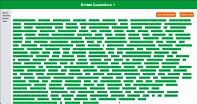

#  🥒 Rotten Cucumbers - The movie database

##  📓 Introduction

A company in the audiovisual sector has asked us for a web application that will allow their employees to quickly find movies from a large database they have, since the process is currently done manually.

You will be in charge of setting up the core of the application: all the logic of filtering and sorting of movies. You have 2 weeks to finish, which is how long this sprint lasts.

<br>

##  ✅ Goals

- Create a web application that allows users to search for movies.

- Separate the logic from the DOM manipulation and modularize the code.

- Write tests for the functions you create.

- The tests must be written using Jest.

- All the tests must pass.


##  📸 Preview





<br>

##  🚀 Getting started

```bash
$ git clone https://github.com/JungleGiu/RottenCucumbers.git
$ cd RottenCucumbers
$ npm install
$ npm run test:watch
```
You will notice how all the tests are passing,and you can see the results in the `test-results.html` file!
Also you can 
```bash
$ right-click on the `index.html` file and select `Open with Live Server`
```

##  📁 Folder Structure


```bash
.
├── index.html
├── test-results.html
├── package.json
├── package-lock.json
├── .gitignore
├── README.md
├── scripts
│   ├── data.js
│   ├── films.js
│   └── view.js
└── tests
    └── films.spec.js
    
``` 

##  🧰 Technologies used

- HTML
- Tailwind
- JavaScript
- Jest

##  ☑️ To Do

- [x] Create a web application that allows users to search for movies.
- [x] Separate the logic from the DOM manipulation and modularize the code.
- [x] Write tests for the functions you create.
- [x] The tests must be written using Jest.
- [x] All the tests must pass.
- [ ] Refactor functions to better utilize array methods.


